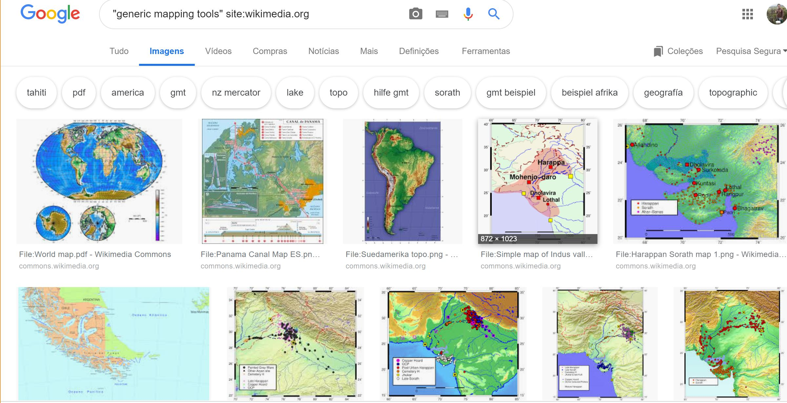

GMT.jl
======

Julia wrapper for the Generic Mapping Tools [GMT](https://github.com/GenericMappingTools/gmt)

| **Documentation**                       | **Build Status (Julia 1.1)**              |
|:---------------------------------------:|:-----------------------------------------:|
| [![][docs-latest-img]][docs-latest-url] | [![][travis-img]][travis-url] [![][appveyor-img]][appveyor-url] [![][codecov-img]][codecov-url] |

[docs-latest-img]: https://img.shields.io/badge/docs-latest-blue.svg
[docs-latest-url]: https://genericmappingtools.github.io/GMT.jl/latest

[travis-img]: https://travis-ci.org/GenericMappingTools/GMT.jl.svg?branch=master
[travis-url]: https://travis-ci.org/GenericMappingTools/GMT.jl

[appveyor-img]: https://ci.appveyor.com/api/projects/status/usjewfb5v48m18kh/branch/master?svg=true
[appveyor-url]: https://ci.appveyor.com/project/joa-quim/gmt-jl-suu4y/branch/master

[codecov-img]: http://codecov.io/github/GenericMappingTools/GMT.jl/coverage.svg?branch=master
[codecov-url]: http://codecov.io/github/GenericMappingTools/GMT.jl?branch=master

The Generic Mapping Tools, **GMT**, is an open source collection of tools for manipulating geographic
and Cartesian data sets (including filtering, trend fitting, gridding, projecting, etc.) and producing
PostScript illustrations ranging from simple x–y plots via contour maps to artificially illuminated
surfaces and 3D perspective views.
[This link](https://www.google.com/search?q=%22generic+mapping+tools%22+site%3Awikimedia.org&tbm=isch#imgrc=_)
will take you to an impressive collection of figures made with **GMT**

This wrapper works with GMT5.3.1 and above and it is intended not only to access to **GMT** from
within the Julia language but also to provide a more modern interface to the **GMT** modules.
For example, instead of using the **GMT** classic syntax to do a line plot:

    gmt psxy filename -R0/10/0/5 -JX12 -W1p -Ba -P > psfile.ps

one can simply do:

    plot("filename", show=true)

or, more verbose but easier to read

    coast(region=:global, proj=:Winkel, frame=:g, area=10000,
          land=:burlywood4, water=:wheat1, figsize=12, show=true)

instead of

    gmt coast -Rd -JR12 -Bg -Dc -A10000 -Gburlywood4 -Swheat1 -P > GMT_winkel.ps

to show

Install
=======

    ]add GMT

A word of warning about the installation. The *GMT.jl* Julia wrapper does **NOT** install the
[GMT](https://github.com/GenericMappingTools/gmt) program. It's the user responsability to do that.

  * Windows64
      It's better to install the [GMT6 version](https://github.com/GenericMappingTools/gmt/releases/download/6.0.0rc1/GMT-6.0.0rc1-win64.exe)

  * Windows32

      Download and install the official version at (the [..._win32.exe](https://github.com/GenericMappingTools/gmt/releases/download/6.0.0rc1/GMT-6.0.0rc1-win32.exe))

  * Unix
  
      Follow instructions at <https://github.com/GenericMappingTools/gmt#install-gmt>

  * In any case, since *GMT* produces PostScript you need a PS visualizer

      Install `Ghostscript` and `ghostview` at <https://www.ghostscript.com/download/gsdnld.html>

On OSX, with a manual GMT build and dependencies obtained with Homebrew (that are installed at
/user/local/lib), I had to help Julia finding MY *libgmt.dylib*, with (this line should than be
added to the ~/.julia/config/startup.jl file)

    push!(Libdl.DL_LOAD_PATH, "/Users/j/programs/gmt5/lib")

Using
=====

The *GMT* Julia wrapper was designed to work in a way the close as possible to the command line version
and yet to provide all the facilities of the Julia language. In this sense, all **GMT** options are put
in a single text string that is passed, plus the data itself when it applies, to the ``gmt()`` command.
However, we also acknowledge that not every one is comfortable with the *GMT* syntax. This syntax is
needed to accommodate the immense pool of options that let you control all details of a figure but that
also makes it harder to read/master.

To make life easier we provide also a new mechanism that use the **GMT** module name directly and where
the program's options are set via keyword arguments. While the monolotic way of using this package is
robust and keeps being updated to latestes **GMT** developments, this *By modules* alternative is a Work
In Progress (the **GMT supplements** were not ported yet) and some things may not work yet. So all help
is most than wellcome.

Documentation
=============

[Latest Docs](https://www.generic-mapping-tools.org/gmt/latest/)

Examples
========

[Some examples](https://genericmappingtools.github.io/GMT.jl/latest/examples)

License
=======

The GMT.jl is free software: you can redistribute it and/or modify it under the terms of the MIT "Expat"
License. A copy of this license is provided in ``LICENSE.txt``
