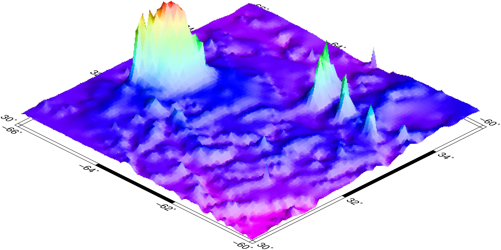

# Examples

## Here's the "Hello World"

```julia
using GMT
plot(1:10, rand(10), lw=1, lc=:blue, fmt=:png, marker=:square,
     markeredgecolor=0, size=0.2, markerfacecolor=:red, title="Hello World",
     xlabel="Spoons", ylabel="Forks", show=true)
```

```@raw html

```

A few notes about this example. Because we didn't specify the figure size (with the ``figsize`` keyword) a default value of 12x8 cm (not counting labels and title) was used. The ``fmt=:png`` selected the
PNG format. The ``show=true`` is needed to show the image at the end.

But now we want an image made up with two layers of data. And we are going to plot on the sphere
(the Earth). For that we will need to use the ``coast`` program to plot the Earth and append
some curvy lines.

## And the "Hello Round World"

```julia
x = range(0, stop=2pi, length=180);       seno = sin.(x/0.2)*45;
coast(region=[0 360 -90 90], proj=(name=:laea, center=(300,30)), frame=:g,
      res=:crude, land=:navy, figsize=6)

plot!(collect(x)*60, seno, lw=0.5, lc=:red, fmt=:png, marker=:circle,
      markeredgecolor=0, size=0.05, markerfacecolor=:cyan, show=true)
```

In this example *region=[0 360 -90 90]*  means the domain is the whole Earth, *frame=:g*
sets the grid on, *resolution=:c* selects the crude coast lines resolution and the 
*land=:navy* paints the continents with a navy blue color. The map projection used here
is a Lambert projection (*laea* stands for *Lambert Azimuthal Equal Area*) with projection
center at 300 degrees East, 30 degrees North.

```@raw html

```

Note that now the first command, the ``coast``, does not have the ``show`` keyword.
It means we are here creating the first layer but we don't want to see it just yet.
The second command uses the **!** variation of the ``plot`` function, which means
that we are *appending* to a previous plot, and uses the ``show=true`` because we
are done with this figure.

## Simple contours

Contours are created with ``grdcontour`` that takes a *grid* as input (or a *GMTgrid* data type).
This example shows uses the *peaks* function to create a classical example. Note, however, that the
memory consumption in this example, when creating the plot, is much lower than traditional likewise 
examples because we will be using only one 2D array instead of 3 3D arrays (ref). In the example
*cont=1* and *annot=2* means draw contours at every 1 unit of the *G* grid and annotate at every other
contour line. *axis="a"* means pick a default automatic annotation and labeling for the axis.

```julia
G = GMT.peaks();
grdcontour(G, cont=1, annot=2, fmt=:png, show=true)
```

```@raw html

```

Now with colored contours. To make it colored we need to generate a color map and use it. Notice
that we must specify a *pen* attribute to get the colored contours because pen specifications
are always set separately. Here we will create first a colormap with *makecpt* that will from -6 to
8 with steps of 1. These values are picked up after the *z* values of the *G* grid. 

```julia
cpt = makecpt(range=(-6,8,1));      # Create the color map
grdcontour(G, fmt=:png, pen=(colored=true,), show=true)
```

```@raw html

```

## Color images

Color images are made with ``grdimage`` which takes the usual common options and a color
map. It operates over grids or images. The next example shows how to create a color
appropriate for the grid's *z* range, plot the image and add a color scale. We use here
the ``data`` keyword to tell the program to load the grid from a file. The ``@`` before
the *tut_relief.nc* file name instructs GMT to download the file from its server on the
first usage and save it in a cache dir. See the [`GMT tuturial`](http://gmt.soest.hawaii.edu/doc/latest/GMT_Tutorial.html#color-images)
for more details about what the arguments mean.

```julia
topo = makecpt(color=:rainbow, range=(1000,5000,500), continuous=true);
grdimage("@tut_relief.nc", shade=(azimuth=100, norm="e0.8"), proj=:Mercator, frame=:a, color=topo)
colorbar!(pos=(anchor=:TC,length=(12.5,0.6), horizontal=true, offset=(0,1.0)),
          color=topo, frame=(ylabel=:m,), fmt=:jpg, show=true)
```

```@raw html

```

## Perspective view

We will make a perspective, color-coded view of the US Rockies from the southeast.


```julia
topo = makecpt(color=:rainbow, range=(1000,5000,500), continuous=true);
grdview("@tut_relief.nc", proj=:Mercator, zsize=1, shade=(azim=100, norm="e0.8"), view=(135,30),
        frame=:a, fmt=:jpg, Q="i100", show=true)
```

```@raw html

```

Above we used the *Peaks* function to create a contour plot. Let us use that grid again and
display it this time as 3D bar plot in a perspective view. 

```julia
cmap = grd2cpt(G);      # Compute a colormap with the grid's data range
bar3(G, lw=:thinnest, color=cmap, fmt=:png, show=true)
```

```@raw html

```

## Warp image in geographical projection

In this example we will load a network image (GDAL will do that for us) and make a
*creative* world map. First command, the *imshow*, needs to set *show=false* to no display
the image before it is complete. We have to do this because *imshow* is a one command
only shot and so, by default, it has the *show* keyword hardwire to *true*.

    imshow("http://larryfire.files.wordpress.com/2009/07/untooned_jessicarabbit.jpg",
          frame=:g, region=:d, proj=:Sinusoidal, image_in=:r, show=false)
    coast!(shore=(1,:white), resolution=:c, figsize=15, fmt=:png, show=true)

```@raw html

```
