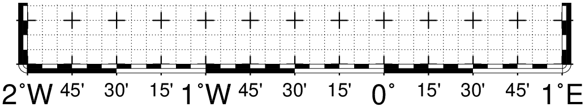
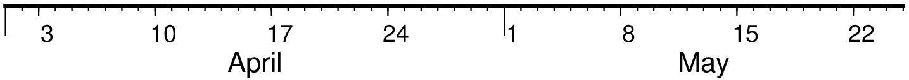
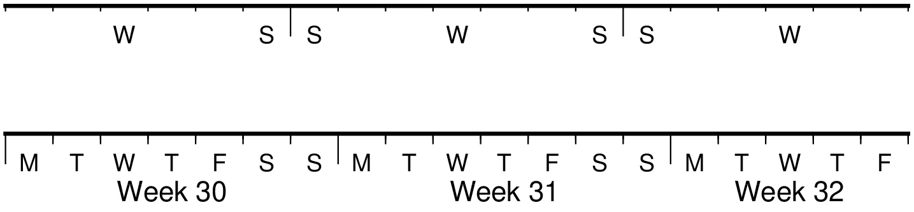
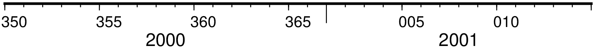
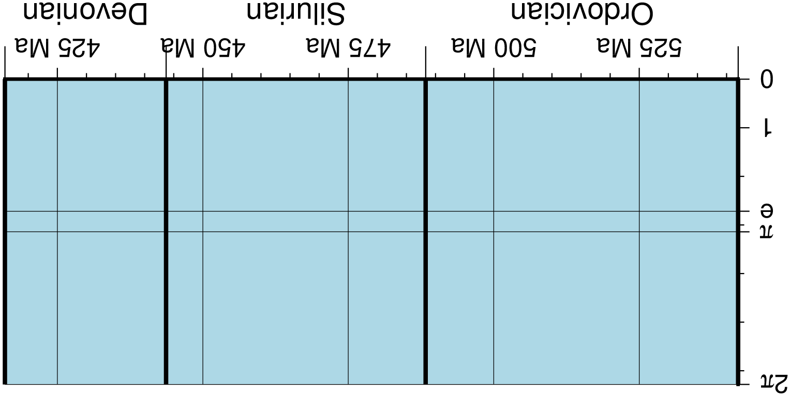

# Draw Frames

## Geographic basemaps

Geographic base maps may differ from regular plot axis in that some projections support a “fancy”
form of axis and is selected by the MAP\_FRAME\_TYPE setting. The annotations will be formatted according
to the FORMAT\_GEO\_MAP template and MAP_DEGREE_SYMBOL setting. A simple example of part of a base map
is shown in Figure Geographic map border.

```julia
using GMT

basemap(limits=(-1,2,0,0.4), proj=:Mercator, figsize=10,
        frame=(axes=:S, annot=1, ticks="15m",grid="5m"))
t = [-1.0 0 0 3.33
      0.25 0 0 0.833
      1.25 0 0 0.28];
arrows!(t, arrow=(length="2p",start=true,stop=true,angle=60), lw=0.5,
        fill=:black, noclip=true, y_off=-0.9)

T = text_record([-0.5 0.05; 0.375 0.05; 1.29166666 0.05], ["annotation", "frame", "grid"]);
text!(T, font=9, justify=:CB, fmt=:png, show=true)
```


The machinery for primary and secondary annotations axes can be utilized for geographic base maps. This may
be used to separate degree annotations from minutes- and seconds-annotations. For a more complicated base map
example using several sets of intervals, including different intervals and pen attributes for grid lines and
grid crosses.

```julia
basemap(region=(-2,1,0,0.35), proj=:Mercator, figsize=10,
        frame=(axes=:wSe, annot="15m", ticks="5m",grid="5m"),
        axis2=(annot=1, ticks="30m", grid="15m"),
        conf=(MAP_FRAME_TYPE="fancy+", MAP_GRID_PEN_PRIMARY="thinnest,black,.",
              MAP_GRID_CROSS_SIZE_SECONDARY=0.25, MAP_FRAME_WIDTH=0.2,
              MAP_TICK_LENGTH_PRIMARY=0.25, FORMAT_GEO_MAP="ddd:mm:ssF",
              FONT_ANNOT_PRIMARY="+8", FONT_ANNOT_SECONDARY=12))
# Draw Arrows and text
t = [-1.875    0 0 0.85
     -0.45833  0 0 0.3
      0.541666 0 0 0.3]
arrows!(t, arrow=(length=0.08, start=true, stop=true, justify=:center),
        lw=0.5, fill=:black, y_offset=-1, no_clip=true)
T = text_record([-2.1 0.025; -1.875 0.05; -0.45833 0.05; 0.541666 0.05],
                ["10p RM P:", "6p CB annotation", "6p CB frame", "6p CB grid"])
text!(T, font="", justify="", no_clip=true)
t = [-1.5 0 0 3.4; -0.25 0 0 1.7; 0.625 0 0 0.85]
arrows!(t, arrow=(length=0.08, start=true, stop=true, justify=:center),
        lw=0.5, fill=:black, y_offset=-0.6, no_clip=true)

T = text_record([-2.1 0.025; -1.5  0.05; -0.25 0.05; 0.625 0.05],
                ["10p RM S:", "9p CB annotation", "9p CB frame", "9p CB grid"])
text!(T, font="", justify="", no_clip=true, fmt=:png, 'show=true)
```



## Cartesian linear axes

For non-geographic axes, the MAP\_FRAME\_TYPE setting is implicitly set to plain. Other than that,
cartesian linear axes are very similar to geographic axes. The annotation format may be controlled with
the FORMAT\_FLOAT\_OUT parameter. By default, it is set to “%g”, which is a C language format statement
for floating point numbers, and with this setting the various axis routines will automatically determine
how many decimal points should be used by inspecting the stride settings. If FORMAT\_FLOAT\_OUT is set to
another format it will be used directly (.e.g, “%.2f” for a fixed, two decimals format). Note that for
these axes you may use the unit setting to add a unit string to each annotation.

```julia
basemap(region=(0,12,0,1), figsize=(12,1),
        frame=(annot=4, ticks=2, grid=1, xlabel="Frequency", suffix="%"),
        axis2=(axes="S",))
t = [0 0 0 4.0; 6.0 0 0 2.0; 9.0 0 0 1.0];
arrows!(t, arrow=(length="2p",start=true,stop=true,angle=60),
        lw=0.5, fill=:black, y_offset=0.25, no_clip=true)
T = text_record([2 0.2; 7 0.2; 9.5 0.2], ["annotation", "frame", "grid"]);
text!(T, font=9, justify=:CB, clearance=(0.025,0.025), fill=:white, fmt=:png, show=true)
```


There are occasions when the length of the annotations are such that placing them horizontally
(which is the default) may lead to overprinting or too few annotations. One solution is to request
slanted annotations for the x-axis via the slanted keyword in frame.

```julia
basemap(region=(2000,2020,35,45), frame=(axes=:S, annot=2, ticks=:auto, slanted=-30),
        fmt=:png, show=true)
```


## Cartesian log10 axes

Due to the logarithmic nature of annotation spacings, the stride parameter takes on specific meanings.
The following concerns are specific to log axes (see Figure Logarithmic projection axis):

   * stride must be 1, 2, 3, or a negative integer -n. Annotations/ticks will then occur at 1, 1-2-5,
     or 1,2,3,4,...,9, respectively, for each magnitude range. For -n the annotations will take place
     every n‘th magnitude.
   * Append l to stride. Then, log10 of the annotation is plotted at every integer log10 value
     (e.g., x = 100 will be annotated as “2”) [Default annotates x as is].
   * Append p to stride. Then, annotations appear as 10 raised to log10 of the value (e.g., 10-5).


```julia
gmt("set MAP_GRID_PEN_PRIMARY thinnest,.")
basemap(region=(1,1000,0,1), proj=:logx, figsize=(8,0.7),
        frame=(axes=:S, annot=1, ticks=2, grid=3, scale=:pow, xlabel="Axis Label"))
basemap!(frame=(axes=:S, annot=1, ticks=2, grid=3, scale=:log,
                xlabel="Axis Label"), y_offset=2.2)
basemap!(frame=(axes=:S, annot=1, ticks=2, grid=3,
                xlabel="Axis Label"), y_offset=2.2, fmt=:png, show=true)
```


## Cartesian exponential axes

Normally, stride will be used to create equidistant (in the user’s unit) annotations or ticks,
but because of the exponential nature of the axis, such annotations may converge on each other
at one end of the axis. To avoid this problem, you can append p to stride, and the annotation
interval is expected to be in transformed units, yet the annotation itself will be plotted as
un-transformed units. E.g., if stride = 1 and power = 0.5 (i.e., sqrt), then equidistant
annotations labeled 1, 4, 9, ... will appear.

```julia
gmt("set MAP_GRID_PEN_PRIMARY thinnest,.")
asemap(region=(0,100,0,0.9), proj="powx,0.5", figsize=(10, 0.65),
       frame=(axes=:S, annot=3, ticks=2, grid=1, scale=:pow, xlabel="Axis Label"))
basemap!(frame=(axes=:S, annot=20, ticks=10, grid=5, xlabel="Axis Label"),
         y_offset=2.2, fmt=:png, show=true)
```


## Cartesian time axes

What sets time axis apart from the other kinds of plot axes is the numerous ways in which we may want
to tick and annotate the axis. Not only do we have both primary and secondary annotation items but we
also have interval annotations versus tick-mark annotations, numerous time units, and several ways in
which to modify the plot. We will demonstrate this flexibility with a series of examples. While all
our examples will only show a single x-axis (south, selected via -BS), time-axis annotations are
supported for all axes.

Our first example shows a time period of almost two months in Spring 2000. We want to annotate the month
intervals as well as the date at the start of each week. Note the leading hyphen in the FORMAT_DATE_MAP
removes leading zeros from calendar items (e.g., 03 becomes 3).

```julia
basemap(region="2000-4-1T/2000-5-25T/0/1", figsize=(12,0.5),
        frame=(axes=:S, annot=7, annot_unit=:day_week, ticks=1, ticks_unit=:day_date),
        axis2=(annot=1, annot_unit=:month),
        conf=(FORMAT_DATE_MAP="-o", FONT_ANNOT_PRIMARY="+9p"), fmt=:png, show=true)
```



The next example shows two different ways to annotate an axis portraying 2 days in July 1969:

```julia
gmtset(FORMAT_DATE_MAP="\"o dd\"", FORMAT_CLOCK_MAP="hh:mm", FONT_ANNOT_PRIMARY=9)
basemap(region="1969-7-21T/1969-7-23T/0/1", figsize=(12,0.5),
        frame=(axes=:S, annot=6, annot_unit=:hour, ticks=1, ticks_unit=:hour2),
        axis2=(annot=1, annot_unit=:ISOweekday))
basemap!(frame=(axes=:S, annot=6, annot_unit=:H, ticks=1, ticks_unit=:hour2),
         axis2=(annot=1, annot_unit=:date), y_offset=1.7, fmt=:png, show=true)
```

The lower example chooses to annotate the weekdays (by specifying a1K) while the upper example
choses dates (by specifying a1D). Note how the clock format only selects hours and minutes
(no seconds) and the date format selects a month name, followed by one space and a two-digit
day-of-month number.


The lower example chooses to annotate the weekdays (by specifying a1K) while the upper example
choses dates (by specifying a1D). Note how the clock format only selects hours and minutes
(no seconds) and the date format selects a month name, followed by one space and a two-digit
day-of-month number.

The third example presents two years, annotating both the years and every 3rd month.

```julia
basemap(region=("1997T","1999T",0,1), figsize=(12,0.25),
        frame=(axes=:S, annot=3, annot_unit=:month, ticks=1, ticks_unit=:month2),
        xaxis2=(annot=1, annot_unit=:Y),
        conf=(FORMAT_DATE_MAP="o", FORMAT_TIME_PRIMARY_MAP="Character", FONT_ANNOT_PRIMARY="+9p"),
        fmt=:png, show=true)
```

Note that while the year annotation is centered on the 1-year interval, the month annotations must
be centered on the corresponding month and not the 3-month interval. The FORMAT\_DATE\_MAP selects
month name only and FORMAT\_TIME\_PRIMARY_MAP selects the 1-character, upper case abbreviation of
month names using the current language (selected by GMT_LANGUAGE).


The fourth example only shows a few hours of a day, using relative time by specifying *t* in the
*region* option while the TIME_UNIT is *d* (for days). We select both primary and secondary annotations,
ask for a 12-hour clock, and let time go from right to left:

```julia
basemap(region=("0.2t","0.35t",0,1), figsize=(-12,0.25),
        frame=(axes=:S, annot="15m", ticks="5m"), axis2=(annot=1, annot_unit=:hour),
        conf=(FORMAT_CLOCK_MAP="-hham", FONT_ANNOT_PRIMARY="+9p", TIME_UNIT="d"),
        fmt=:png, show=true)
```


The fifth example shows a few weeks of time (Figure Cartesian time axis, example 5). The lower
axis shows ISO weeks with week numbers and abbreviated names of the weekdays. The upper uses
Gregorian weeks (which start at the day chosen by TIME\_WEEK\_START); they do not have numbers.

```julia
basemap(region="1969-7-21T/1969-8-9T/0/1", figsize=(12,0.25),
        frame=(axes=:S, annot=1, annot_unit=:ISOweekday),
        axis2=(annot=1, annot_unit=:ISOweek),
        conf=(FORMAT_DATE_MAP=:u, FORMAT_TIME_PRIMARY_MAP=:Character, FORMAT_TIME_SECONDARY_MAP=:full, FONT_ANNOT_PRIMARY=9))
basemap!(frame=(axes=:S, annot=3, annot_unit=:ISOweekday, ticks=1, ticks_unit=:weekday),
         axis2=(annot=1, annot_unit=:Gregorian_week),
         conf=(FORMAT_DATE_MAP=:o, TIME_WEEK_START=:Sunday, FORMAT_TIME_SECONDARY_MAP=:Character),
         y_offset=1.7, fmt=:png, show=true)
```



Our sixth example shows the first five months of 1996, and we have annotated each month with an
abbreviated, upper case name and 2-digit year. Only the primary axes information is specified.

```julia
basemap(region=("1996T","1996-6T",0,1), figsize=(12,0.25),
        frame=(axes=:S, annot=1, annot_unit=:month, ticks=1, ticks_unit=:day_date),
        conf=(FORMAT_DATE_MAP="\"o yy\"", FORMAT_TIME_PRIMARY_MAP="Abbreviated"),
        fmt=:png, show=true)
```


Our seventh and final example illustrates annotation of year-days. Unless we specify the
formatting with a leading hyphen in FORMAT\_DATE\_MAP we get 3-digit integer days. Note that in
order to have the two years annotated we need to allow for the annotation of small fractional
intervals; normally such truncated interval must be at least half of a full interval.

```julia
using GMT
basemap(region=("2000-12-15T","2001-1-15T",0,1), figsize=(12,0.25),
        frame=(axes=:S, annot=5, annot_unit=:date, ticks=1, ticks_unit=:day_date),
        axis2=(annot=1, annot_unit=:year),
        conf=(FORMAT_DATE_MAP="jjj", TIME_INTERVAL_FRACTION=0.05, FONT_ANNOT_PRIMARY="+9p"),
        fmt=:png, show=true)
```



## Custom axes


```julia
    basemap(region=(416,542,0,6.2831852), figsize=(-12,5),
            frame=(frame=(:left_full, :bot_full), fill=:lightblue),
            xaxis=(annot=25, ticks=5, grid=25, suffix=" Ma"),
            yaxis=(custom=(pos=[0 1 2 2.71828 3 3.1415926 4 5 6 6.2831852],
                type_=["a", "a", "f", "ag e", "f", "ag @~p@~", "f", "f", "f", "ag 2@~p@~"]),),)

    basemap!(frame=(axes=(:left_full, :bot_full),),
            xaxis2=(custom=(pos=[416.0; 443.7; 488.3; 542],
                            type=["ig Devonian", "ig Silurian", "ig Ordovician", "ig Cambrian"]),),
            par=(MAP_ANNOT_OFFSET_SECONDARY="10p", MAP_GRID_PEN_SECONDARY="2p"), fmt=:png, show=true)
```

