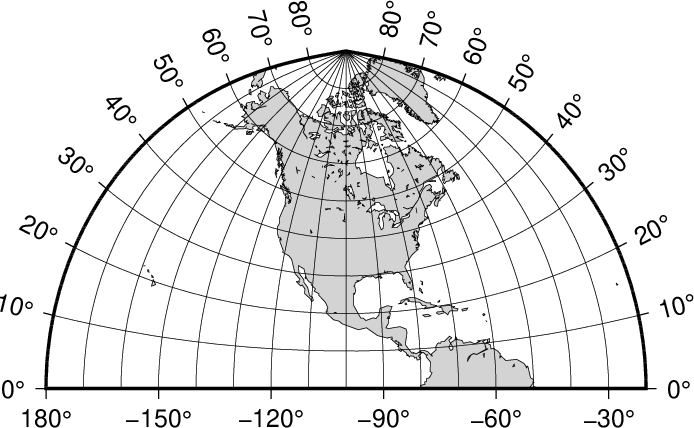
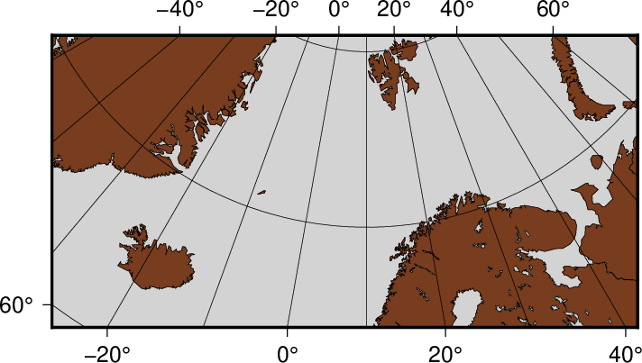
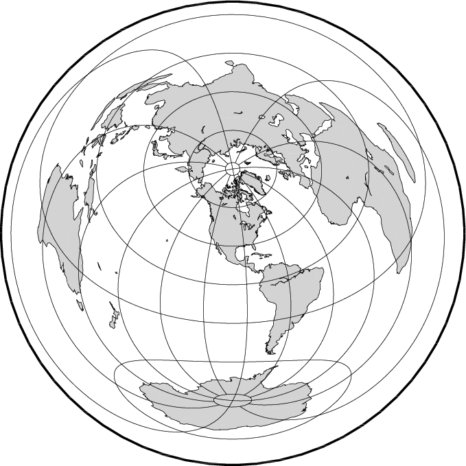
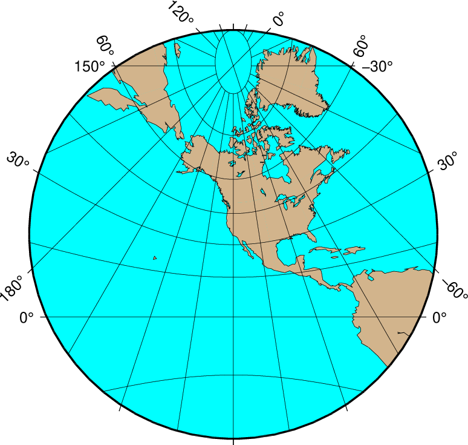
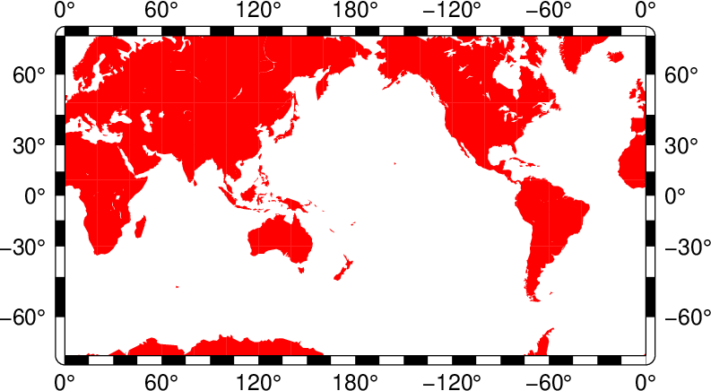
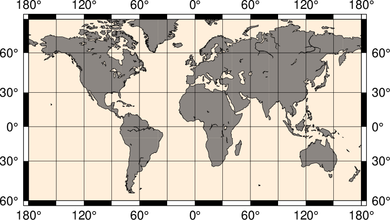
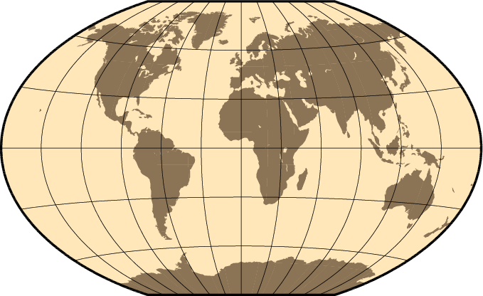
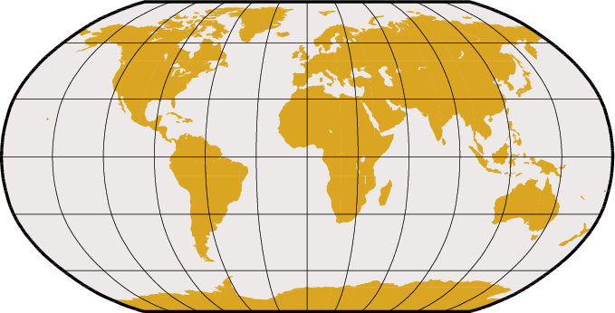

| Albers equal-area conic  | Equidistant conic  | Lambert conformal conic |  (American) polyconic |
|:-------------:|:---------:|:-------------:|:-------------:|
|[][Albers conic equal-area projection](@ref) | [][Equidistant conic](@ref) | [][Lambert conic conformal](@ref) | [][(American) polyconic projection](@ref) |

| Lambert Azimuthal Equal-Area (rect) | Lambert Azimuthal Equal-Area (hemi) | Polar Stereographic | Rectangular stereographic |
|:-------------:|:---------:|:-------------:|:-------------:|
|[][Rectangular map](@ref) | [][Hemisphere map](@ref) | [][Polar Stereographic Map](@ref) | [][Rectangular stereographic map](@ref) |

| Perspective | Orthographic  | Lambert conformal conic | Gnomonic |
|:-------------:|:---------:|:-------------:|:-------------:|
|[][Perspective](@ref) | [][Orthographic](@ref) | [][Azimuthal Equidistant](@ref) | [][Gnomonic](@ref) |

| Mercator | Transverse Mercator | Oblique Mercator | Cassini |
|:-------------:|:---------:|:-------------:|:-------------:|
|[][Mercator](@ref) | [][Transverse Mercator](@ref) | [][Oblique Mercator](@ref) | [][Cassini cylindrical](@ref) |

| Cylindrical equidistant | Cylindrical equal-area | Miller Cylindrical | Cylindrical stereographic |
|:-------------:|:---------:|:-------------:|:-------------:|
|[][Cylindrical equidistant](@ref) | [][Cylindrical equal-area](@ref) | [][Miller Cylindrical](@ref) | [][Cylindrical stereographic](@ref) |

| Hammer | Mollweide | Winkel Tripel | Robinson |
|:-------------:|:---------:|:-------------:|:-------------:|
|[][Hammer](@ref) | [][Mollweide](@ref) | [][Winkel Tripel](@ref) | [][Robinson](@ref) |

| Eckert IV | Sinusoidal | Sinusoidal int | Van der Grinten |
|:-------------:|:---------:|:-------------:|:-------------:|
|[][Eckert IV and VI](@ref) | [][Sinusoidal](@ref) | [][Sinusoidal](@ref) | [][Van der Grinten](@ref) |
