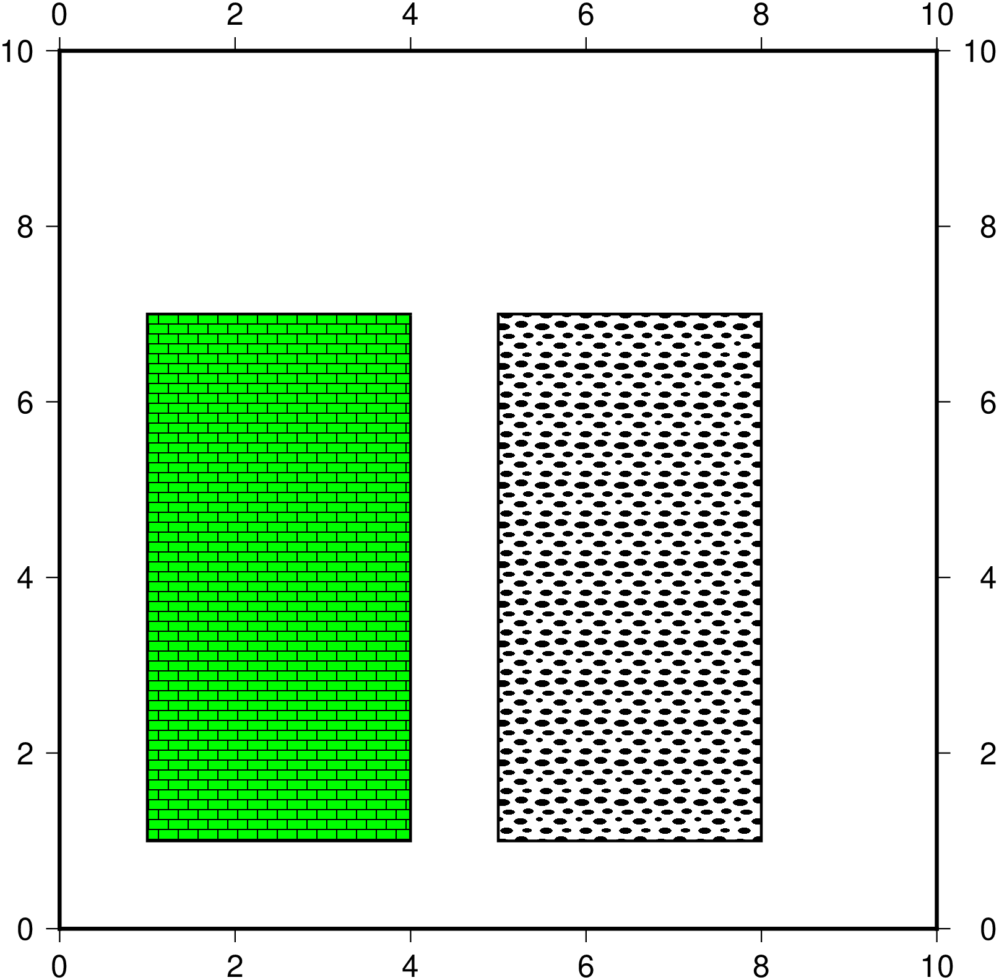

# Draw rectangles

## Simple filled rectangle

```julia
using GMT
rect = [2 2; 2 6; 6 6; 6 2; 2 2];
plot(rect, region=[0 10 0 10], lw=1, fill=:blue, axis=:a, axis=:equal, fmt=:png, show=true)
```


## Rectangles with patterns

Now add some patterns. The full pattern syntax is explained in [GMT patterns]
(http://gmt.soest.hawaii.edu/doc/latest/GMT_Docs.html#specifying-area-fill-attributes)
but basically we are using pattern number 20 at 200 dpi and a blue background for the left rectangle
and pattern 89 also at 200 dpis for the right rectangle.

```julia
using GMT
rect = [1 1; 1 7; 4 7; 4 1; 1 1];
plot(rect, region=[0 10 0 10], lw=1, fill="p20+bgreen+r200", axis=:a, axis=:equal)
plot!([4 0].+rect, lw=1, fill="p89+r200", fmt=:png, show=true)
```



## Rectangles with transparency

This variation creates rectangles with 0, 30% and 70% transparency as well as different boundary lines.

```julia
using GMT
rect = [0.5 0.5; 0.5 7; 2.5 7; 2.5 0.5; 0.5 0.5];
plot(rect, region=[0 10 0 10], lw=0.5, fill=:blue, axis=:a, axis=:equal")
plot!([3 0].+rect, lw=1, ls="--", fill=:blue, transparency=30)
plot!([6 0].+rect, lw=2, lc=:red, fill=:blue, transparency=70, fmt=:png, show=true)
```


